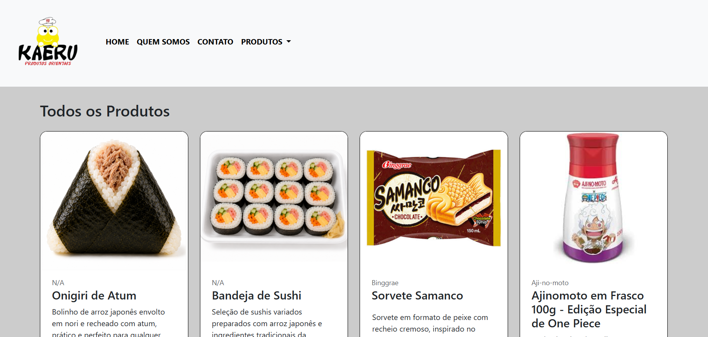

# 🐸 Kaeru Produtos Orientais — 商品カタログ

[🇧🇷 Português](README.md) | [🇺🇸 English](README.en.md) | 🇯🇵 **日本語**

Centro Universitário Integradoの**システム分析・開発（ADS）**コースで制作した大学のWeb開発プロジェクトです。

**Kaeru Produtos Orientais**という東洋の商品を扱う実在の店舗をもとに、商品やカテゴリーを閲覧できるオンラインカタログを制作しました。

## 📸 プレビュー

## ✨ 主な機能

- 商品の動的表示
- カテゴリーによる商品の絞り込み
- カテゴリーの動的読み込み
- データベース連携
- ページ間のナビゲーション
- レスポンシブデザイン
- 店舗紹介ページ
- お問い合わせページ

## 🛠️ 使用技術

- PHP
- MySQL / MariaDB
- HTML
- CSS
- Bootstrap
- JavaScript
- PDO

## 🗂️ システムについて

このリポジトリには、Kaeru Produtos Orientaisプロジェクトの**一般ユーザー向けの商品カタログ**が含まれています。

カタログで使用されるデータは、別に開発した管理システムから管理できます。

## ⚙️ ローカル環境での実行

このプロジェクトはPHPとMySQL/MariaDBを使用しており、XAMPPなどのローカル開発環境で実行できます。

実行する前に、使用する環境に合わせてデータベース接続を設定する必要があります。

## 🔗 管理システム

このプロジェクトには、システムを管理するための別の管理アプリケーションもあります。

➡️ [**Kaeru Produtos Orientais — 管理システム**](https://github.com/wdninjaytb/kaeru-admin)

## 🎓 制作背景

**システム分析・開発（ADS）**コースの大学課題として制作したプロジェクトです。

公開インターフェースの制作、データベース連携、PHPを使用した動的な機能の実装などに取り組みました。

## ⚠️ 注意事項

このプロジェクトは、ブラジル・パラナ州カンポ・モウランにある実在の店舗 **Kaeru Produtos Orientais** の許可を得て、大学の学習目的で制作しました。

プロジェクト内の店舗情報は、開発時に許可を得て使用しています。

このリポジトリでは、大学での学習およびポートフォリオを目的としてソースコードのみを公開しています。このアプリケーションは店舗の公式Webサイトではなく、公開サービスとしてホスティングされていません。
